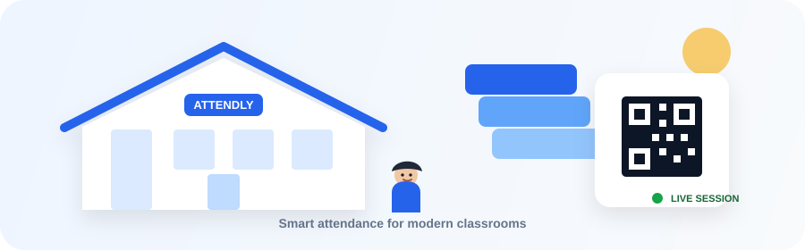

<div align="center">

# 🎓 Attendly

### QR-Powered Smart Attendance for Modern Classrooms

<p>
  <strong>Fast check-ins • Temporary QR sessions • Reliable attendance records</strong>
</p>

<p>
  
  
  
  
</p>

</div>

---

## 🏫 What is Attendly?

**Attendly** is a modern QR-based classroom attendance system designed for schools, colleges, training institutes, and academic teams.

Instead of calling names or maintaining paper registers, a teacher creates a temporary attendance session and displays a QR code. Students scan the code with their phones, and Attendly verifies and records their attendance automatically.

> **Teacher creates → Class scans → Attendly verifies → Attendance recorded**

---

<div align="center">


</div>

<!--
If this repository contains the SVG locally, replace the image above with:

-->

---

## ✨ Why Attendly?

| 🧑‍🏫 For Teachers | 🎒 For Students |
|---|---|
| Create attendance sessions in seconds | Scan a classroom QR |
| Generate temporary QR codes | No manual attendance entry |
| Track session participation | View attendance percentage |
| Review date-wise reports | Check attendance history |
| Reduce manual paperwork | Get instant confirmation |

---

## 🧭 How It Works

```text
                 ┌───────────────────────┐
                 │       TEACHER         │
                 │  Creates a session    │
                 └───────────┬───────────┘
                             │
                             ▼
                 ┌───────────────────────┐
                 │      ATTENDLY         │
                 │ Generates unique QR   │
                 │ + expiry time         │
                 └───────────┬───────────┘
                             │
                             ▼
                 ┌───────────────────────┐
                 │    CLASSROOM QR       │
                 │       ▦ ▦ ▦           │
                 └───────────┬───────────┘
                             │
                  Students scan the code
                             │
                             ▼
                 ┌───────────────────────┐
                 │       VERIFY          │
                 │ Token • Expiry        │
                 │ Duplicate check       │
                 └───────────┬───────────┘
                             │
                             ▼
                 ┌───────────────────────┐
                 │     ATTENDANCE        │
                 │    ✓ Recorded         │
                 └───────────────────────┘
```

---

## 🎓 School-Friendly Design

Attendly uses a visual language inspired by a modern school environment:

- 📚 Clean academic dashboard
- 🎓 Education-focused branding
- 🧑‍🏫 Teacher and student workflows
- 📋 Familiar attendance terminology
- 🏫 Calm blue academic accent
- 📝 Clear tables and reports
- 📱 Mobile-friendly student check-in
- 🌙 Purpose-built Light and Dark modes

The interface intentionally avoids the look of a generic admin template and focuses on the classroom workflow.

---

## 🚀 Core Features

### 🧑‍🏫 Teacher Portal

- Teacher authentication
- Teacher dashboard
- Create attendance sessions
- Select QR validity duration
- Generate unique QR codes
- View all QR sessions
- Reopen existing session QR codes
- View present student count
- Date-wise attendance reports
- Attendance rate calculations

### 🎒 Student Portal

- Student authentication
- Student dashboard
- Attendance percentage
- Recent attendance
- Complete attendance history
- QR check-in
- Duplicate attendance protection
- Attendance success/error feedback

### 🔐 Attendance Security

Every attendance session receives a cryptographically generated token.

The server verifies:

```text
QR Token
   ↓
Does the session exist?
   ↓
Has the QR expired?
   ↓
Has this student already attended?
   ↓
Record attendance
```

The database also contains a unique constraint:

```sql
UNIQUE KEY unique_student_session (session_id, student_id)
```

This provides an additional layer of protection against duplicate attendance.

---

## 🖥️ Screens

### Landing Page

A school-themed public landing page introducing Attendly and its classroom workflow.

### Teacher Dashboard

```text
┌───────────────────────────────────────────────┐
│ Attendly                         System online │
├──────────────┬────────────────────────────────┤
│              │ Good morning, Teacher         │
│ Overview     │                                │
│ New Session  │  Students  Sessions  Rate      │
│ QR Sessions  │    42        18      91%      │
│ Reports      │                                │
│              │ Recent attendance sessions     │
│ Dark Mode    │                                │
└──────────────┴────────────────────────────────┘
```

### QR Session

The teacher gets a dedicated QR display page suitable for classroom projection.

### Student Dashboard

Students can see:

- Overall attendance rate
- Recorded sessions
- Recent attendance
- Attendance history

---

## 📱 QR Scanning

There are two ways to scan an Attendly QR code.

### Method 1 — Phone Camera

This is the simplest method.

1. Teacher creates an attendance session.
2. Teacher opens **QR Sessions → Open QR**.
3. Teacher displays the QR code.
4. Student opens the phone camera.
5. Student points the camera at the QR.
6. The phone opens the Attendly URL.
7. Student must be logged into Attendly.
8. Attendly validates the session.
9. Attendance is recorded.

### ⚠️ Important: `localhost` and phones

If XAMPP is running at:

```text
http://localhost/Attendly/
```

a phone **cannot use that URL to reach your computer**.

For phone scanning, both devices should be on the same Wi-Fi network.

Find your PC's local IPv4 address:

```bash
ipconfig
```

Example:

```text
IPv4 Address . . . . . . : 192.168.1.10
```

Then configure:

```php
define(
    'APP_URL',
    'http://192.168.1.10/Attendly'
);
```

Now newly generated QR codes can point to the computer's LAN address.

---

## 🧑‍💻 Method 2 — Built-in Camera Scanner

The student **Scan QR** page also supports an in-browser QR scanner.

Open:

```text
http://YOUR-PC-IP/Attendly/scan.php
```

Then:

```text
Scan QR
   ↓
Start camera scanner
   ↓
Allow camera permission
   ↓
Point camera at teacher QR
   ↓
QR detected
   ↓
Attendance verification
```

> Browser camera access can require HTTPS. If the LAN HTTP page cannot access the camera, use the phone's normal camera app instead.

---

## 🛠️ Tech Stack

<div align="center">

| Technology | Purpose |
|---|---|
| 🐘 PHP 8+ | Backend and application logic |
| 🗄️ MySQL 8+ | Attendance database |
| 🎨 HTML5 | Semantic page structure |
| 🎨 CSS3 | Responsive design system |
| ⚡ JavaScript | UI interactions and theme system |
| ▦ QRCode.js | QR generation |
| 📱 HTML5 QR Scanner | Browser-based QR scanning |
| 🔐 PDO | Secure database queries |

</div>

---

## 📁 Project Structure

```text
Attendly/
│
├── 📂 assets/
│   ├── 📂 css/
│   │   └── app.css
│   └── 📂 js/
│       └── app.js
│
├── 📂 config/
│   ├── auth.php
│   ├── database.php
│   └── helpers.php
│
├── 📂 partials/
│   ├── header.php
│   └── footer.php
│
├── 🏠 index.php
├── 🔐 login.php
├── 🚪 logout.php
│
├── 🧑‍🏫 teacher_dashboard.php
├── ➕ create_session.php
├── ▦ attendance_qr.php
├── ▦ qr_sessions.php
├── 📊 reports.php
│
├── 🎒 student_dashboard.php
├── 📱 scan.php
├── 📋 attendance_history.php
│
├── 🗄️ database.sql
└── 📖 README.md
```

---

## ⚙️ Installation

### 1. Install XAMPP

Install XAMPP with:

- Apache
- MySQL
- PHP

### 2. Clone / copy the project

Place the project inside:

```text
C:\xampp\htdocs\
```

Example:

```text
C:\xampp\htdocs\Attendly
```

### 3. Start XAMPP

Start:

```text
Apache    ✓
MySQL     ✓
```

### 4. Create the database

Open:

```text
http://localhost/phpmyadmin
```

Import:

```text
database.sql
```

The SQL creates:

```text
qr_attendance
```

---

## 🔑 Demo Accounts

### Teacher

```text
Email:
teacher@attendly.test

Password:
password
```

### Student

```text
Email:
student@attendly.test

Password:
password
```

---

## 🌐 Open Attendly

After starting Apache and MySQL:

```text
http://localhost/Attendly/
```

Landing page:

```text
/
```

Login:

```text
/login.php
```

Teacher:

```text
/teacher_dashboard.php
```

Student:

```text
/student_dashboard.php
```

---

## 🔄 Attendance Lifecycle

```text
CREATE SESSION
      │
      ▼
Generate random token
      │
      ▼
Set expiry time
      │
      ▼
Generate QR
      │
      ▼
Student scans
      │
      ▼
Validate token
      │
      ├──── Invalid ────► ❌ Reject
      │
      ▼
Check expiry
      │
      ├──── Expired ────► ⏱️ Reject
      │
      ▼
Check duplicate
      │
      ├──── Already marked ────► ✓ Already recorded
      │
      ▼
Insert attendance
      │
      ▼
             🎉 PRESENT
```

---

## 🌗 Theme System

Attendly includes intentionally designed:

### ☀️ Light Mode

- White academic surfaces
- Soft classroom background
- Blue primary accent
- Clear borders
- High readability

### 🌙 Dark Mode

- Deep navy/charcoal surfaces
- Muted academic panels
- Soft blue accent
- Adjusted borders and shadows
- Contrast-aware text

The selected theme is stored using:

```javascript
localStorage
```

Users don't need to select their preferred theme every time they return.

---

## ♿ Accessibility & UX

Attendly includes:

- Semantic HTML
- Visible focus states
- Readable contrast
- Responsive layouts
- Keyboard-friendly controls
- Clear success/error messages
- Empty states
- Form validation feedback
- Reduced-motion support

Users who prefer reduced motion are supported through:

```css
@media (prefers-reduced-motion: reduce)
```

---

## 🔒 Security Considerations

The MVP uses:

- `password_hash()`
- `password_verify()`
- PDO prepared statements
- `random_bytes()`
- Session regeneration after login
- Unique attendance constraints
- Temporary QR tokens
- Server-side expiry validation

### Recommended production hardening

Before deploying publicly, add:

- CSRF protection
- HTTPS
- Environment variables for database credentials
- Rate limiting
- Login attempt protection
- Audit logs
- Stronger session cookie settings
- Role-based authorization middleware
- Student/class roster management
- Secure QR scanner configuration

---

## 🗃️ Database Design

```text
users
 │
 ├──────────────► attendance_sessions
 │                       │
 │                       ▼
 │                  attendance
 │                       ▲
 │                       │
 └──────► students ──────┘
```

### `users`

```text
id
name
email
password
role
created_at
```

### `students`

```text
id
user_id
roll_number
course
```

### `attendance_sessions`

```text
id
teacher_id
subject
session_token
session_date
expires_at
created_at
```

### `attendance`

```text
id
session_id
student_id
marked_at
```

---

## 🧪 Example Session

Imagine a teacher creates:

```text
Subject:
Database Management Systems

Date:
25 September 2026

QR validity:
10 minutes
```

Attendly generates a unique session token.

The QR points to:

```text
/scan.php?token=UNIQUE_SESSION_TOKEN
```

A student scans it.

Attendly verifies the session and records:

```text
Student: Sherin Student
Subject: Database Management Systems
Status: Present
Marked at: 10:14 AM
```

---

## 🗺️ Roadmap

### Current MVP

- [x] Landing page
- [x] Teacher login
- [x] Student login
- [x] Teacher dashboard
- [x] Create attendance session
- [x] QR generation
- [x] QR expiry
- [x] Student check-in
- [x] Duplicate prevention
- [x] Attendance history
- [x] Attendance percentage
- [x] Date-wise reports
- [x] Light/Dark mode
- [x] Responsive UI

### Next Version

- [ ] Teacher creates classes
- [ ] Student enrollment
- [ ] Subject management
- [ ] Timetable
- [ ] Per-subject attendance percentage
- [ ] CSV export
- [ ] PDF reports
- [ ] Live attendance updates
- [ ] Teacher attendance roster
- [ ] Student profile
- [ ] Admin dashboard
- [ ] Email notifications
- [ ] Attendance shortage alerts

---

## 🏫 Designed for Education

Attendly can be adapted for:

```text
🏫 Schools
🎓 Colleges
💻 Computer Institutes
📚 Coaching Centers
🧑‍🏫 Training Institutes
🏢 Corporate Training
```

---

## 🤝 Contributing

Contributions are welcome.

```bash
git clone YOUR_REPOSITORY_URL
cd Attendly
```

Create a feature branch:

```bash
git checkout -b feature/your-feature
```

Commit your changes:

```bash
git add .
git commit -m "feat: add your feature"
```

Push:

```bash
git push origin feature/your-feature
```

Then open a pull request.

---

## 📜 License

This project is available for educational and development purposes.

Add your preferred license before publishing the repository publicly.

---

<div align="center">

### 🎓 Attendly

**Making classroom attendance simpler, one scan at a time.**

<br>

`Teacher → QR → Student → Verification → Attendance ✓`

<br>

⭐ If you find Attendly useful, consider starring the repository.

</div>
